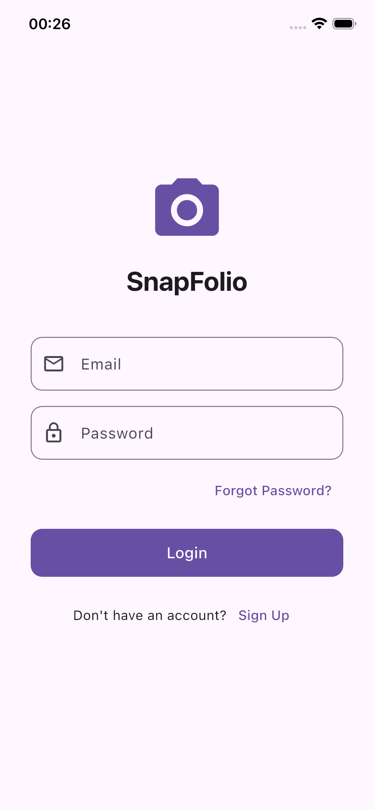
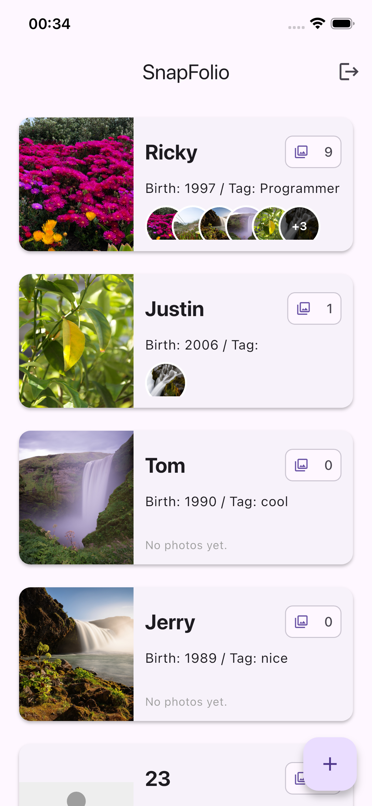
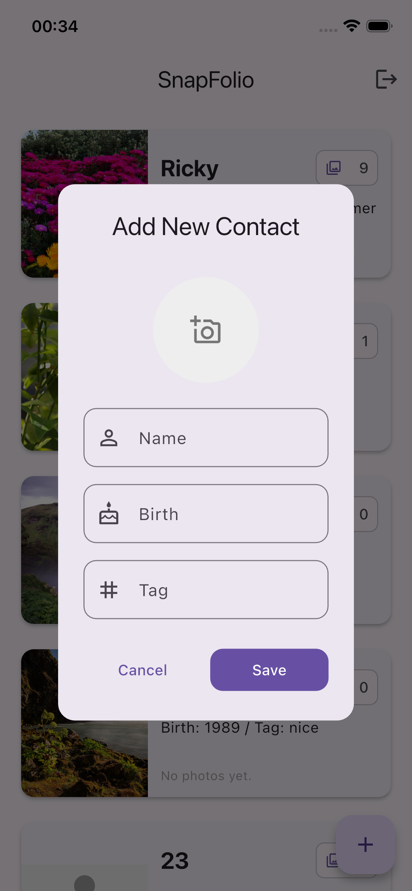
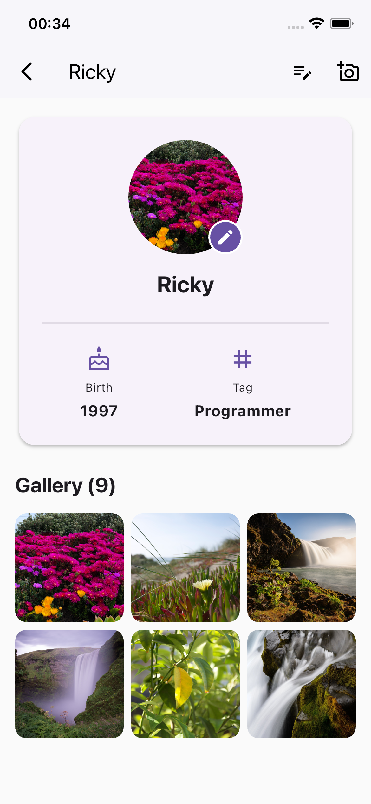
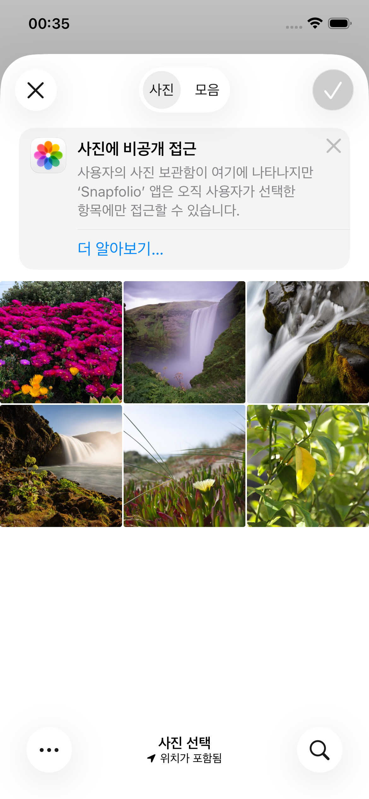

# SnapFolio 📸


## 日本語 🇯🇵

**SnapFolio** は、Flutter で構築された視覚的に豊かな連絡先管理アプリケーションです。
単なるテキストリストを超え、ユーザーの画面幅に動的に適応する独自の**レスポンシブな写真プレビュー**システムを備えており、ギャラリーファーストの体験を提供します。

### 📱 プレビュー

| リストビュー (レスポンシブ) | 詳細ビュー (ギャラリー) | 詳細ビュー (ギャラリー) |
|:-------------------------:|:---------------------------:|:---------------------------:|
|  |  | |

| リストビュー (レスポンシブ) | 詳細ビュー (ギャラリー) | 
|:-------------------------:|:---------------------------:|
|  |  |

### ✨ 主な機能

*   **レスポンシブな写真プレビュー**
    *   `LayoutBuilder` を使用して、利用可能なデバイス幅に基づいて表示する最適な写真サムネイル数を数学的に計算します。
    *   より多くの写真が存在する場合、最後の表示スロットに賢く `+N` オーバーレイを表示します。
*   **アダプティブUIレイアウト**
    *   テキストの長さに関係なくレイアウトの破損を防ぐために、防御的なコーディング (`TextOverflow`、`maxLines`) を実装しました。
    *   `IntrinsicHeight` と `AspectRatio` を使用して、一貫したカード比率を維持します。
*   **詳細ギャラリー**
    *   詳細なプロフィールビューへのシームレスなナビゲーション。
    *   連絡先の写真コレクション全体を閲覧するためのフル機能のスクロール可能な `GridView`。

### 🛠 テックスタック

*   **フレームワーク:** Flutter
*   **言語:** Dart
*   **状態管理:** (予定: Riverpod/Provider)
*   **バックエンド (予定):** Firebase (Auth, Firestore, Storage)

---

## English 🇬🇧

**SnapFolio** is a visually rich contact management application built with Flutter.
Moving beyond simple text lists, it features a unique **responsive photo preview** system that dynamically adapts to the user's screen width, offering a gallery-first experience.

### 📱 Preview

| List View (Responsive) | Detail View (Gallery) |
|:-------------------------:|:---------------------------:|
|  |  |
> *Please add screenshots to the `assets/screenshots/` directory and update the paths above.*

### ✨ Key Features

*   **Responsive Photo Preview**
    *   Utilizes `LayoutBuilder` to mathematically calculate the optimal number of photo thumbnails to display based on the available device width.
    *   Intelligently displays a `+N` overlay on the last visible slot if more photos exist.
*   **Adaptive UI Layout**
    *   Implemented defensive coding (`TextOverflow`, `maxLines`) to prevent layout breakage regardless of text length.
    *   Maintains consistent card ratios using `IntrinsicHeight` and `AspectRatio`.
*   **Detail Gallery**
    *   Seamless navigation to a detailed profile view.
    *   Full-feature scrollable `GridView` to browse the entire photo collection of a contact.

### 🛠 Tech Stack

*   **Framework:** Flutter
*   **Language:** Dart
*   **State Management:** (Planned: Riverpod/Provider)
*   **Backend (Planned):** Firebase (Auth, Firestore, Storage)

## 🚀 Getting Started

Follow these steps to run the project locally.

### Prerequisites

*   Ensure you have the Flutter SDK installed. ([Installation Guide](https://docs.flutter.dev/get-started/install))

### Installation

1.  **Clone the repository**
    ```bash
    git clone [https://github.com/IAmRickyChoi/SnapFolio.git](https://github.com/IAmRickyChoi/SnapFolio.git)
    ```
2.  **Install dependencies**
    ```bash
    flutter pub get
    ```
3.  **Run the app**
    ```bash
    flutter run
    ```

## 📝 License

Distributed under the **MIT License**. See the `LICENSE` file for more information.

## 👤 Author

**Ricky Choi**
* GitHub: [@IAmRickyChoi](https://github.com/IAmRickyChoi)
* Zenn: [@0570yh](https://zenn.dev/0570yh)
